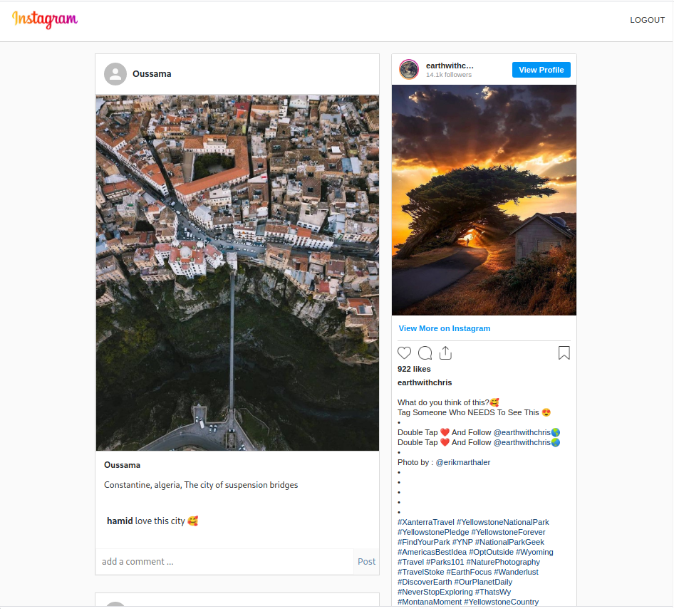

# Description

This is a simple clone application for the popular Instagram app.

### Used technologies
  - React.js
  - firebase for database, authentication and hosting.
  - React-instagram-embed (you need your own Access token : a combination of App Id and Client Token )
### Functionalities
  - Sign Up, Sign In,logout
  - Add post, comments
  - Upload photos

### It should look like this:

